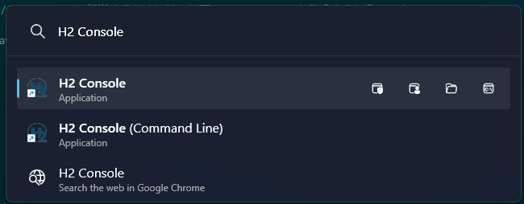
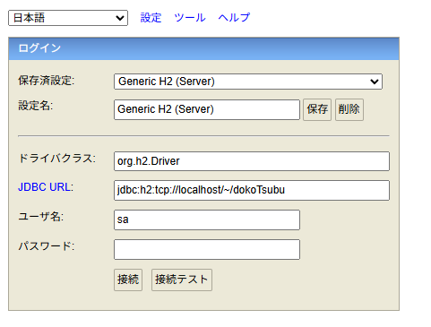

# Spring 版 どこつぶ (`dokoTsubuSpring`)の注意点

## 1. ⚠️ 公式ソースコードの不足ファイル

公式GitHubリポジトリ（https://github.com/miyabilink/sukkiri-servlet5-codes/tree/main/dokoTsubuSpring）には、Web付録（ビューにJSPを使用する設定：https://sukkiri.jp/books/sukkiri_servlet5/sukkiri_servlet5_appendix/ssj5-spring-jsp-setting.html）で指示されている以下の2ファイルが含まれていません。プロジェクト作成時にご自身で設定を追加する必要があります。

- **`pom.xml`**
- **`application.properties`**

## 🌐 `http://localhost:8080/` の404エラー回避策

教科書の指示通りルート（`/`）にアクセスすると、Spring側で処理先を判断できず **404エラー（Whitelabel Error Page）** になります。

Web付録では `http://localhost:8080/index.jsp` への直接アクセスで回避するよう案内されていますが、以下の `IndexController` を新規作成することで、ルートへのアクセスを自動的に `index.jsp` へ転送（フォワード）させることが可能です。

```java (src/main/java/com/example/demo/controller/IndexController.java)
@Controller
public class IndexController {
  @GetMapping("/")
  public String index() {
    return "forward:/index.jsp";
  }
}
```

## 3. H2 Databaseの起動

Spring版「どこつぶ」はH2 Databaseを使用するため、アプリケーションの実行前にデータベースを起動しておく必要があります。

### 手順1: H2 Consoleの起動

`Alt + Space`（またはWindowsキー）などで検索窓を開き、「**H2 Console**」と検索してアプリケーションを起動します。



### 手順2: データベースへの接続

起動後、ブラウザでH2 Consoleのログイン画面が開きます。以下の設定値になっているか確認（または入力）し、「接続」ボタンをクリックしてください。

| 項目               | 設定値                                |
| ------------------ | ------------------------------------- |
| **保存済設定**     | Generic H2 (Server)                   |
| **設定名**         | Generic H2 (Server)                   |
| **ドライバクラス** | `org.h2.Driver`                       |
| **JDBC URL**       | `jdbc:h2:tcp://localhost/~/dokoTsubu` |
| **ユーザ名**       | `sa`                                  |
| **パスワード**     | _（空欄）_                            |



# 補足

## Spring版「どこつぶ」作成・修正ファイル一覧

Chapter 15で「どこつぶ」をSpring Bootプロジェクト（`dokoTsubuSpring`）として作り直す際に、**修正（以前のコードをベースに書き換え）または新規作成するファイル**を以下の表にまとめました。

| カテゴリ         | ファイル名                  | 変更内容・ポイント                                                                                                                         | 参照箇所                          |
| :--------------- | :-------------------------- | :----------------------------------------------------------------------------------------------------------------------------------------- | :-------------------------------- |
| **モデル**       | `User.java`                 | **Lombok**を導入し、getterやコンストラクタを自動生成するように修正。                                                                       | コード15-17                       |
|                  | `Mutter.java`               | **Lombok**を導入。一部手書きのコンストラクタを維持。                                                                                       | コード15-18                       |
| **サービス**     | `LoginService.java`         | `LoginLogic`から改名。**`@Service`**を付与。                                                                                               | コード15-19                       |
|                  | `PostMutterService.java`    | `PostMutterListLogic`から改名。**`@Service`**を付与。                                                                                      | コード15-20                       |
|                  | `GetMutterListService.java` | `GetMutterListLogic`から改名。**`@Service`**を付与。                                                                                       | コード15-21                       |
| **コントローラ** | `LoginController.java`      | サーブレット`Login`を書き換え。**`@Controller`**、**DI（依存性の注入）**、引数でのセッション取得などを適用。                               | コード15-22                       |
|                  | `LogoutController.java`     | サーブレット`Logout`を書き換え。                                                                                                           | コード15-23                       |
|                  | `MainController.java`       | サーブレット`Main`を書き換え。2つのサービスを同時にDI。未ログイン時はリダイレクト。                                                        | コード15-24                       |
|                  | `IndexController.java`      | **【※任意】**`/` へのアクセスを `src/main/webapp/index.jsp` にフォワードさせたい場合にこのControllerを新規作成。                           | -                                 |
| **ビュー**       | `index.jsp`                 | 配置場所を `src/main/webapp` に設定。                                                                                                      | 表15-4                            |
|                  | `logout.jsp`                | 配置場所を `src/main/webapp/WEB-INF/jsp` に設定。                                                                                          | 表15-4                            |
|                  | `main.jsp`                  | 同上                                                                                                                                       | 表15-4                            |
|                  | `loginResult.jsp`           | 同上                                                                                                                                       | 表15-4                            |
| **設定/その他**  | `pom.xml`                   | **【※公式ソースコードには存在しない】**組み込みTomcatでJSPを実行するための`tomcat-embed-jasper`と、JSTLを使用するための依存関係を追加。    | Web付録:ビューにJSPを使用する設定 |
|                  | `application.properties`    | **【※公式ソースコードには存在しない】**Controllerが返すビュー名を`WEB-INF/jsp/`配下のJSPファイルにマッピングするビューリゾルバ設定を追加。 | Web付録:ビューにJSPを使用する設定 |

---

## `pom.xml` に依存関係を追加する理由

Spring Boot の組み込み Tomcat で JSP を実行・コンパイルするためには Jasper (`tomcat-embed-jasper`) が必要です。これがない場合、JSP が正しく実行されず、静的リソースとして探されて 404 になることがあります。
また、`WEB-INF/jsp/main.jsp` などで `<c:out>` や `<c:if>` などの JSTL タグを実行するため、JSTL 用の依存関係も必要です。

```xml
<!-- JSP実行用 -->
<dependency>
  <groupId>org.apache.tomcat.embed</groupId>
  <artifactId>tomcat-embed-jasper</artifactId>
</dependency>

<!-- JSTL用 -->
<dependency>
  <groupId>jakarta.servlet.jsp.jstl</groupId>
  <artifactId>jakarta.servlet.jsp.jstl-api</artifactId>
</dependency>
<dependency>
  <groupId>org.glassfish.web</groupId>
  <artifactId>jakarta.servlet.jsp.jstl</artifactId>
</dependency>
```

## `application.properties` の設定が必要な理由

Controller が `return "main";` や `return "loginResult";` のようにビュー名を返した際に、実際の JSP ファイルへ変換するための設定です。

```properties
spring.mvc.view.prefix=/WEB-INF/jsp/
spring.mvc.view.suffix=.jsp
```

この設定により、例えば `return "main";` が `/WEB-INF/jsp/main.jsp` として処理されるようになります。
